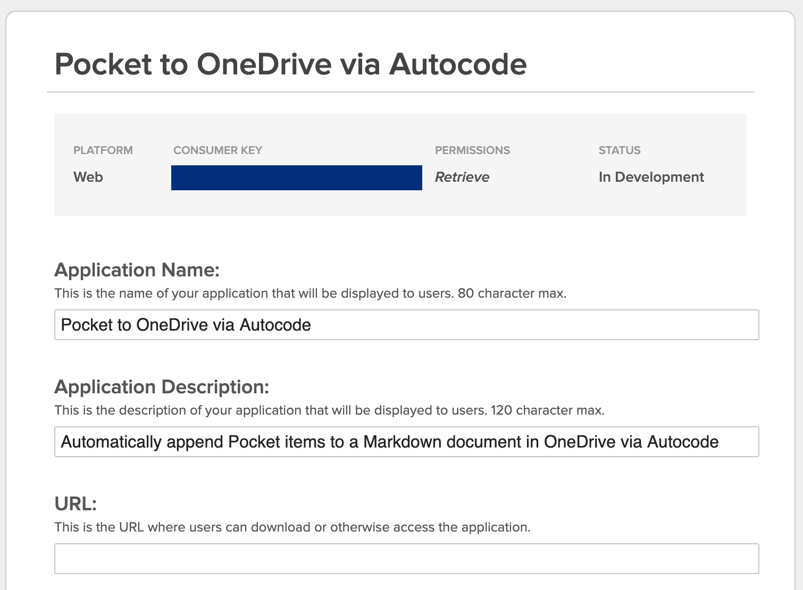
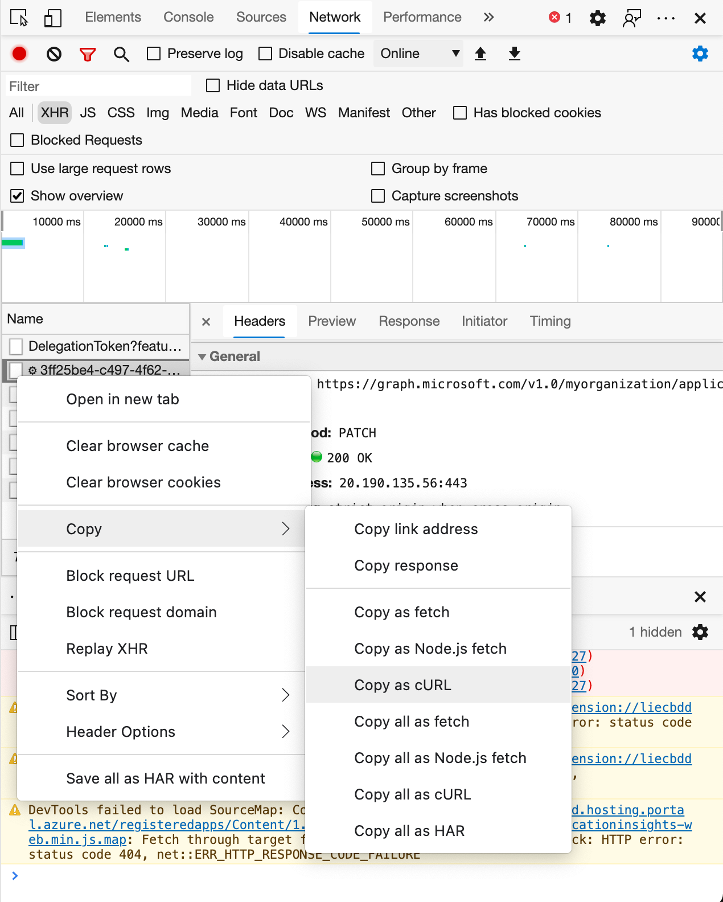

# pocket-to-onedrive
[](https://open.autocode.com/)

Automatically synchronize your [Pocket](https://getpocket.com/) items with a Markdown file in [OneDrive](https://onedrive.live.com/).

When new items are added to your Pocket, new list items are appended to the specified Markdown file in the "checklist" format:

```md
- [ ] https://example.com
- [ ] ...
```

## Setup

1. [Create a Pocket application](https://getpocket.com/developer/apps/new):

    

2. [Register an Azure App for OneDrive API access](https://docs.microsoft.com/en-us/onedrive/developer/rest-api/getting-started/graph-oauth?view=odsp-graph-online#register-your-app).

    For **Supported account types**, choose "Accounts in any organizational directory (Any Azure AD directory - Multitenant) and personal Microsoft accounts (e.g. Skype, Xbox)
  ". Leave **Redirect URI** blank for now.

    Once the app is registered, go to **Manage** -> **Authentication** -> **Add a platform** -> **Web**. Under **Redirect URIs**, paste the Autocode endpoint for the `onedrive_auth_callback` function but _witout the @ symbol_, e.g. `https://spencer.api.stdlib.com/pocket-to-onedrivedev/onedrive_auth_callback/`. For some reason, Azure has some client-side validation which disallows the @ symbol in redirect URIs, but we can get around this by making the API call directly with cURL. Before clicking **Configure**, open your network dev tools. Then click **Configure** and observe a PATCH request made to `https://graph.microsoft.com/v1.0/myorganization/applications/<some-uuid>`. Right-click and "Copy as cURL", then edit the request body so it includes the full endpoint URL with the @ symbol (`https://spencer.api.stdlib.com/pocket-to-onedrive@dev/onedrive_auth_callback/`), and run the cURL request.
  
    
  
    Go to **Manage** -> **Certificates and secrets** -> **New client secret**, create a client secret which doesn't expire and copy its value.

3. Configure environment variables:

    - `SECRET_KEY`: A random string which prevents an attacker from guessing your `pocket_auth_callback` and `pocket_login` endpoints and logging in with their own Pocket account. You can generate a UUID.  
      e.g. `aa971e90-c644-4361-b1a1-16d4cdecfd59`
    - `PHONE_NUMBER`: The phone number which will be sent an SMS message when Pocket/OneDrive login is required.  
      e.g. `1-416-555-5555`
    - `ONEDRIVE_FILE_PATH`: The path in your OneDrive to the Markdown file which should be modified.  
      e.g. `/Obsidian/Spencer/Notes/Pocket.md`
    - `ONEDRIVE_CLIENT_ID`: The "Application (client) ID" of the registered Azure App.  
      e.g. `406ec2cf-ffff-ffff-ffff-ffffffffffff`
    - `ONEDRIVE_APP_CLIENT_SECRET`: The value of the Azure App client secret created in step (2).  
      e.g. `B-1_eeeee.uuu.HHHHHH_c._x_77777777`
    - `ONEDRIVE_AUTH_CALLBACK_ENDPOINT`: The public Autocode endpoint for the `onedrive_auth_callback` function.  
      e.g. `https://spencer.api.stdlib.com/pocket-to-onedrive@dev/onedrive_auth_callback/`
    - `POCKET_APP_CONSUMER_KEY`: The consumer key of the Pocket application created in step (1).  
      e.g. `94945-xxxxxxxxxxxxxxxxxxxxxxxx`
    - `POCKET_LOGIN_ENDPOINT`: The public Autocode endpoint for the `pocket_login` function.  
      e.g. `https://spencer.api.stdlib.com/pocket-to-onedrive@dev/pocket_login/`
    - `POCKET_AUTH_CALLBACK_ENDPOINT`: The public Autocode endpoint for the `pocket_auth_callback` function.  
      e.g. `https://spencer.api.stdlib.com/pocket-to-onedrive@dev/pocket_auth_callback/`
